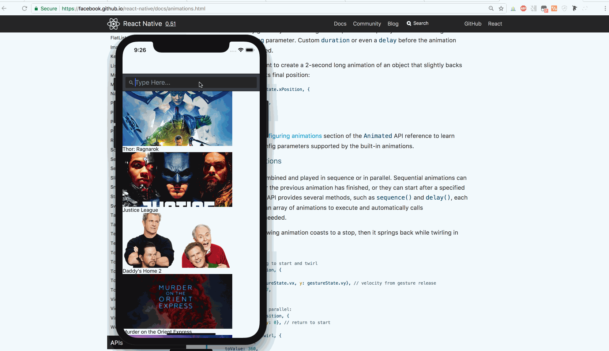

## React Class - Homework 2 - Flexie Native

Submitted by: Toan Ngo

Time spent: ~6 hours

**User Stories**

The following required stories should be completed:

[x] User can view a list of movies currently playing in theaters from The Movie Database. API should be loaded by the fetch api.
[x] Use the latest movies data from the Movie Database API
[x] Ensure you can hit the "Now Playing" endpoint in a browser. This shows the data we will be using from The Movies Database.
[x] User can view movie details by tapping on a cell. This will navigate to a second screen! Remember what you learned in class about Stack Navigator.
[x] User can pull to refresh.
*The following advanced user stories are optional: (high, med, and low refer to the effort to implement the feature, with high being the most work and low being the least)*

Add a tab bar for Now Playing or Top Rated movies. (med)
Switch layouts between list view (one column) or grid view (two columns). To show multiple columns, you'll want to use the numColumns prop. (med)
[x] Add simple animation using React Native LayoutAnimation. React Native Layout Animation is awesome.
[x] All images fade in as they are loading. (see below)
Hint: The image should only fade in if it's coming from network, not cache. Try the library called react-native-image-progress.
[x] Add a search bar to filter movie results, like you did in the previous assignment. (low)

## Video Walkthrough

Here's a walkthrough of implemented user stories:

## License

    Copyright [2017] [Toan Ngo]

    Licensed under the Apache License, Version 2.0 (the "License");
    you may not use this file except in compliance with the License.
    You may obtain a copy of the License at

        http://www.apache.org/licenses/LICENSE-2.0

    Unless required by applicable law or agreed to in writing, software
    distributed under the License is distributed on an "AS IS" BASIS,
    WITHOUT WARRANTIES OR CONDITIONS OF ANY KIND, either express or implied.
    See the License for the specific language governing permissions and
    limitations under the License.